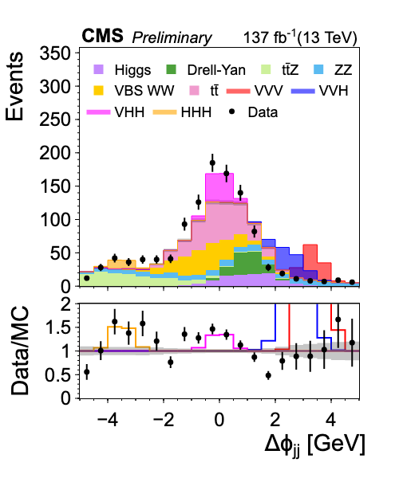

# PlotlyJSWrapper.jl

[](https://sgnoohc.github.io/PlotlyJSWrapper.jl/dev/)

A wrapper of [PlotlyJS](https://github.com/JuliaPlots/PlotlyJS.jl) to plot HEP-style plots quickly with [FHist](https://github.com/Moelf/FHist.jl) as inputs

## Quick Example
```julia
using PlotlyJSWrapper
using FHist

# Creating example histograms
h1 = Hist1D(randn(3000),-5:0.5:5)
h2 = Hist1D(randn(1000).+1,-5:0.5:5)
h3 = Hist1D((randn(1000).+2)./2,-5:0.5:5)
h4 = Hist1D((randn(2000).-2).*2,-5:0.5:5)
h5 = Hist1D(randn(2000).*5,-5:0.5:5)
h6 = Hist1D(randn(2000).-0.5,-5:0.5:5)
data = Hist1D(randn(9000),-5:0.5:5)
signal = Hist1D((randn(1000).+10)./3,-5:0.5:5)

# Plotting
plot_stack(

  # Hists are FHist's Hist1D

  # Background histograms
  backgrounds=[h1, h2, h3,
               h4, h5, h6],

  # Data histograms
  data=[data],

  # Signal histograms
  signals=[signal, signal2,
           signal3, signal4],

  # Options
  xaxistitle = "Δϕ<sub>jj</sub> [GeV]",
  outputname = "plot.pdf",
  backgroundlabels =
        ["tt̄",
         "Higgs",
         "Drell-Yan",
         "tt̄Z",
         "ZZ",
         "VBS WW"],
  signallabels =
        ["VVV",
         "VVH",
         "VHH",
         "HHH"],
  # Some extra features
  stacksignals = true,
  hideratio = false,
  showsignalsinratio = true,

)
```     

